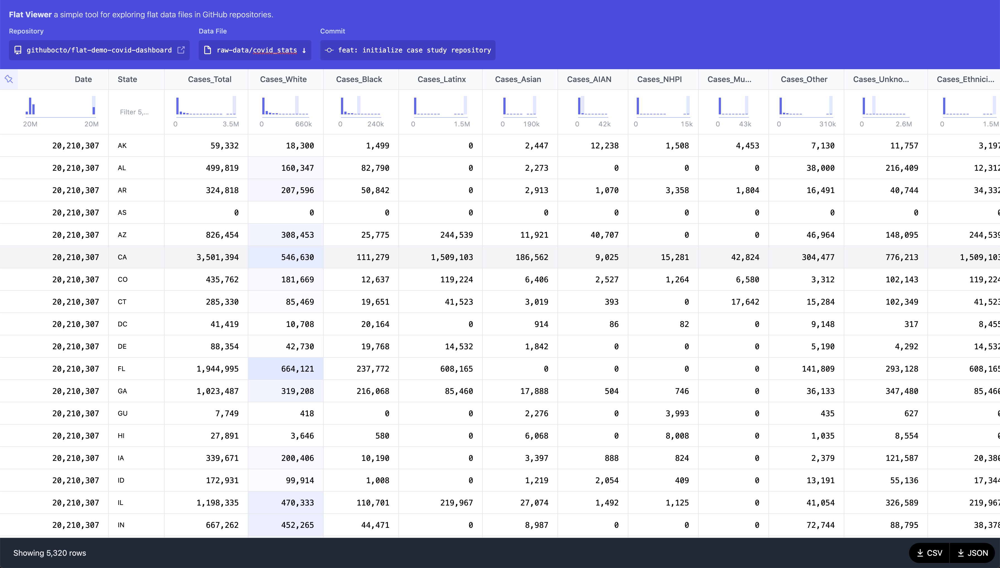

# Flat Viewer

👉🏽 👉🏽 👉🏽 **Full writeup**: [Flat Data Project](https://octo.github.com/projects/flat-data) 👈🏽 👈🏽 👈🏽

Flat Viewer is a tool to view un-nested data (CSV & JSON files) in an interactive table. The table has various affordances for exploring the data, such as:

- filtering
- sorting
- sticky header and column
- diffs for specific commits that change the data



## What is Flat Data? 

Flat Viewer is part of a larger project to make it easy to fetch and commit data into GitHub repositories. The action is intended to be run on a schedule, retrieving data from any supported target and creating a commit if there is any change to the fetched data. Flat Data builds on the [“git scraping” approach pioneered by Simon Willison](https://simonwillison.net/2020/Oct/9/git-scraping/) to offer a simple pattern for bringing working datasets into your repositories and versioning them, because developing against local datasets is faster and easier than working with data over the wire.

## Usage

To use Flat Viewer, prepend `flat` to the URL of your GitHub repo:

from: [`github.com/githubocto/flat-demo-covid-dashboard`](http://github.com/githubocto/flat-demo-covid-dashboard)
to: [`flatgithub.com/githubocto/flat-demo-covid-dashboard`](http://flatgithub.com/githubocto/flat-demo-covid-dashboard)

## Development

To run locally:

```bash
yarn # to install dependencies
yarn dev
```

## Deployment

flatgithub.com will automatically re-build and deploy when changes are pushed to the `main` branch.

## Issues

If you run into any trouble or have questions, feel free to [open an issue](https://github.com/githubocto/flat-editor/issues).

❤️ GitHub OCTO

## License

[MIT](LICENSE)
